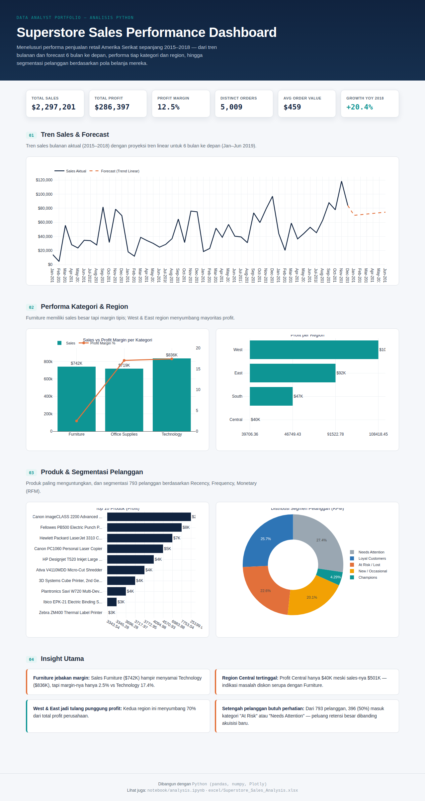
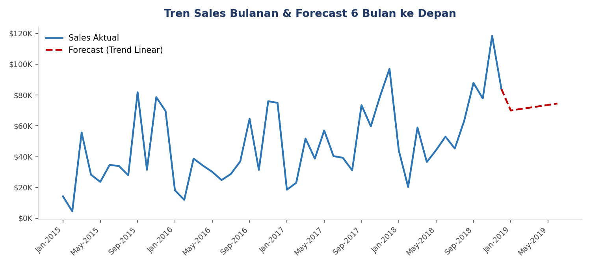
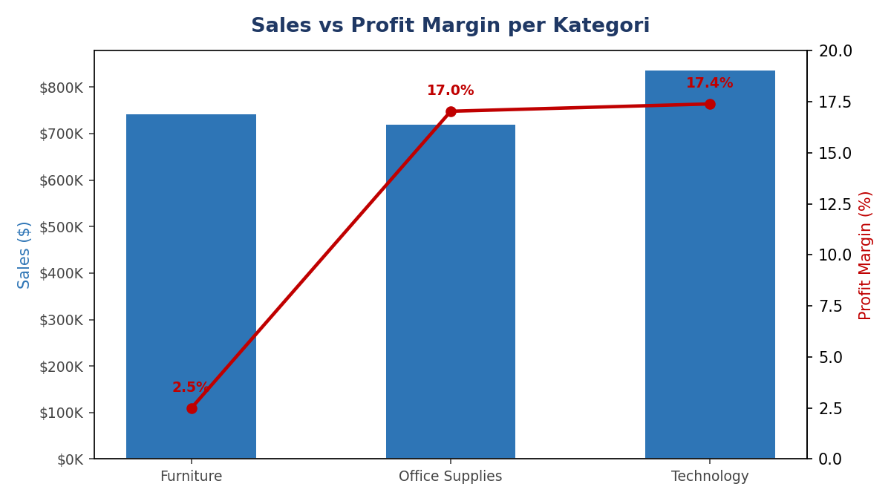
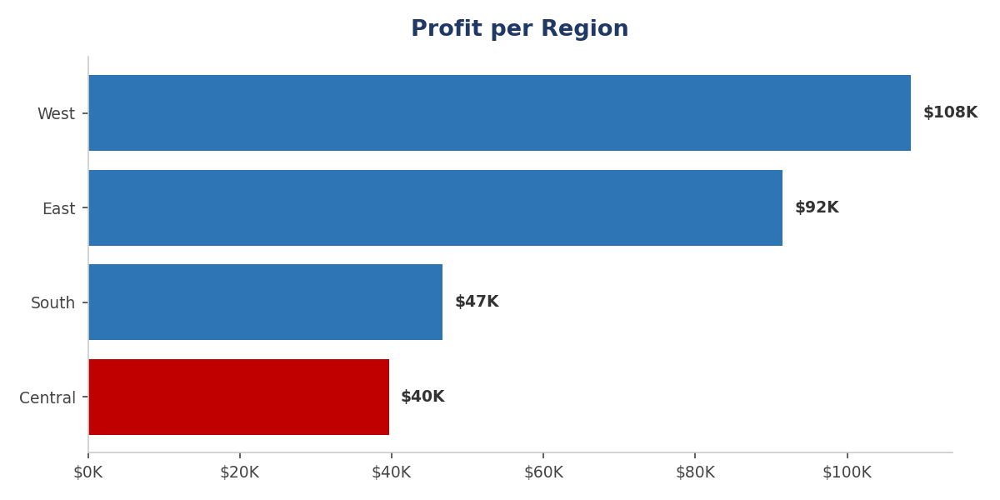
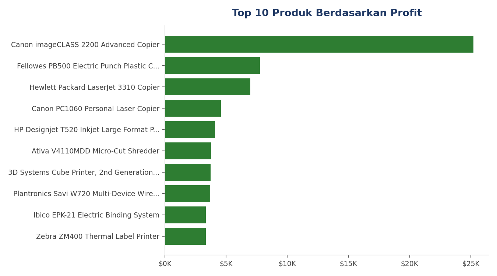
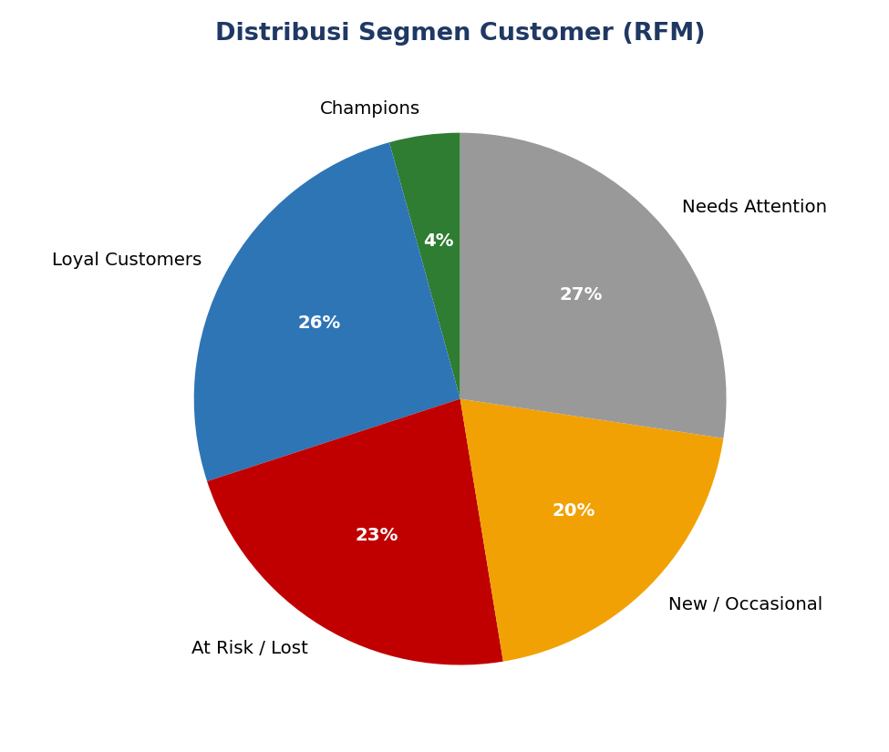

# 📊 Superstore Sales Performance Analysis

**Analisis, Forecasting, dan Segmentasi Pelanggan menggunakan Excel & Python**

Analisis penjualan retail Amerika Serikat (2015–2018) untuk menjawab satu pertanyaan bisnis: **produk, kategori, region, dan pelanggan mana yang benar-benar mendorong profit serta di mana diskon justru diam-diam menggerus keuntungan?**

Proyek ini dikerjakan dalam **dua jalur analisis yang saling melengkapi**: Excel (formula live, pivot-style, forecasting) dan Python (pandas/numpy untuk analisis, Plotly untuk dashboard interaktif).

<p align="center">
  
</p>

<p align="center"><i>Dashboard interaktif lengkap: <a href="https://alnafs23.github.io/Superstore-Sales-Analysis/dashboard/dashboard.html">buka versi live di sini</a>, atau jalankan <code>dashboard/dashboard.html</code> secara lokal.</i></p>

---

## Ringkasan Eksekutif

| Metrik | Nilai |
|---|---|
| Total Sales | **$2,297,201** |
| Total Profit | **$286,397** |
| Profit Margin | **12.5%** |
| Distinct Orders | **5,009** |
| Average Order Value | **$459** |
| Growth Sales 2018 vs 2017 | **+20.4%** |

**4 Insight Utama:**
1. **Furniture adalah jebakan margin** — sales-nya ($742K) hampir menyamai Technology ($836K), tapi margin-nya hanya 2.5% vs Technology 17.4%.
2. **Beberapa produk teknologi mahal justru merugi** — 3 unit 3D printer & 1 printer laser rugi lebih dari $17K gabungan.
3. **West & East menyumbang ~70% total profit**, sementara region Central tertinggal jauh meski sales-nya tidak kecil.
4. **Sekitar 50% pelanggan berada di segmen "At Risk" atau "Needs Attention"** (analisis RFM) — peluang retensi besar dibanding hanya fokus akuisisi pelanggan baru.

Ringkasan [`docs/Case_Study_Summary.pdf`](docs/Case_Study_Summary.pdf)

---

## 🗂️ Struktur Proyek

```
├── data/
│   ├── Superstore_Orders_Clean.csv         # Data sumber (9.994 baris, sudah dibersihkan)
│   └── customer_rfm_segmentation.csv       # Hasil segmentasi RFM per pelanggan
│
├── excel/
│   └── Superstore_Sales_Analysis.xlsx      # Analisis Excel: dashboard, forecast, RFM (formula live)
│
├── notebook/
│   ├── analysis.ipynb                      # Notebook Python lengkap (narasi + kode + chart)
│   ├── 1_analisis_data.py                  # Script analisis (KPI, tren, kategori, RFM)
│   └── 2_generate_charts.py                # Script generate chart statis (PNG untuk README)
│
├── dashboard/
│   ├── dashboard.html                      # Dashboard interaktif (pengganti Power BI)
│   ├── dashboard_data.json                 # Data hasil olahan yang dipakai dashboard
│   └── plotly.min.js                       # Library chart (di-bundle lokal, tanpa perlu internet)
│
├── images/                                 # Chart PNG statis untuk README
│
└── docs/
    ├── Case_Study_Summary.pdf              # Ringkasan 1 halaman untuk portofolio/LinkedIn
    └── Superstore_PowerBI_Guide.docx       # Panduan opsional jika ingin membangun versi Power BI
```

---

## Tools & Stack

| Tools | Fungsi |
|---|---|
| **Excel** | Dashboard formula-driven (SUMIFS/COUNTIFS, `FORECAST()`, `QUARTILE`/`IFS` untuk RFM), pivot-style summary |
| **Python** (pandas, numpy) | Cleaning data, agregasi, forecasting tren linear, segmentasi RFM |
| **Plotly.js** | Dashboard interaktif (HTML, bisa dibuka langsung di browser, tanpa server) |
| **Matplotlib / Seaborn** | Chart statis untuk notebook & README |
| **Jupyter Notebook** | Narasi analisis step-by-step dengan kode & visualisasi inline |

> **Catatan soal Power BI:** proyek ini awalnya direncanakan menyertakan file Power BI (`.pbix`), namun karena kendala teknis pada aplikasi Power BI Desktop, seluruh analisis & visualisasi dipindahkan ke **Python + dashboard HTML interaktif** sebagai pengganti yang setara — bahkan lebih portable karena bisa dibuka langsung di browser tanpa instalasi apa pun. Panduan Power BI tetap disertakan di `docs/` bagi yang ingin mencobanya.

---

## Detail Analisis

### 1. Tren Sales Bulanan & Forecast

Forecast 6 bulan ke depan (Jan–Jun 2019) dihitung dengan regresi linear (`numpy.polyfit`, setara `FORECAST()` di Excel) berdasarkan 48 bulan histori aktual.



### 2. Performa Kategori & Region




### 3. Top 10 Produk Berdasarkan Profit



### 4. Segmentasi Pelanggan (RFM)

Setiap pelanggan diberi skor Recency, Frequency, dan Monetary (kuartil 1–4), lalu dikelompokkan menjadi 5 segmen actionable.



---

## Cara Menjalankan

**Melihat dashboard interaktif** (tidak perlu instalasi apa pun):
```bash
# cukup buka file ini di browser
dashboard/dashboard.html
```

**Menjalankan ulang analisis Python:**
```bash
pip install pandas numpy matplotlib seaborn
cd notebook
python 1_analisis_data.py      # menghasilkan dashboard/dashboard_data.json
python 2_generate_charts.py    # menghasilkan chart PNG di images/
```

**Membuka notebook:**
```bash
jupyter notebook notebook/analysis.ipynb
```

**Membuka file Excel:**
Buka `excel/Superstore_Sales_Analysis.xlsx` dengan Microsoft Excel — semua angka dihitung dengan formula live (SUMIFS, COUNTIFS, FORECAST, QUARTILE/IFS), jadi otomatis re-kalkulasi jika data sumber diganti.

---

## Tentang Data

Dataset: **Sample Superstore** — data transaksi retail Amerika Serikat yang banyak digunakan untuk studi kasus Business Intelligence (9.994 baris order, 5.009 order unik, 793 pelanggan, 1.850 produk, periode Januari 2015 – Desember 2018).

## 📌 Rekomendasi Bisnis

1. **Batasi/tinjau ulang diskon Furniture** di atas ambang tertentu (mis. 20%); re-pricing produk yang konsisten rugi (3D printer, printer laser tertentu).
2. **Investigasi kebijakan diskon region Central** untuk menutup gap dengan West/East yang sales-nya sebanding namun profit jauh lebih tinggi.
3. **Luncurkan kampanye win-back** untuk pelanggan segmen "At Risk" / "Needs Attention" sebelum menambah budget akuisisi pelanggan baru.
